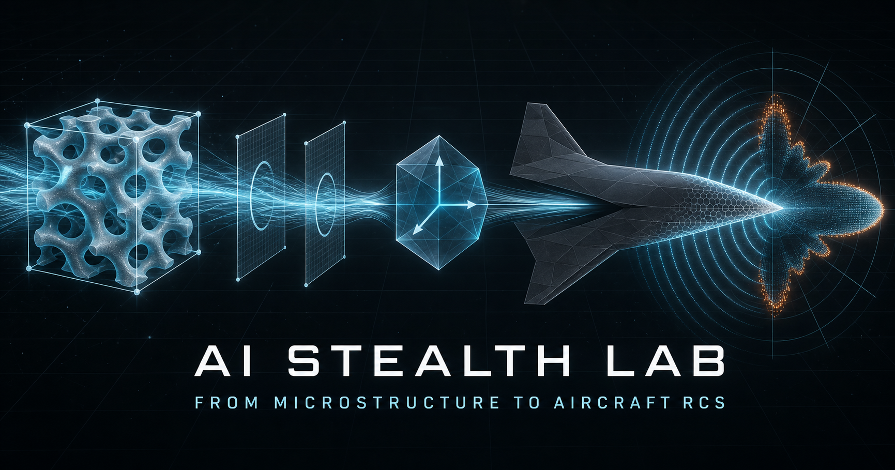
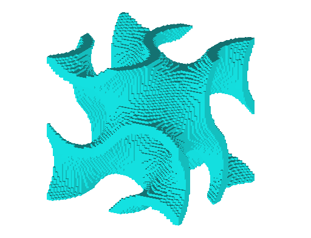
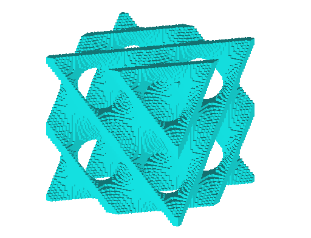
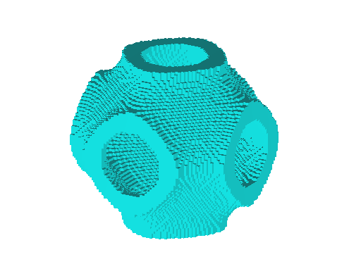
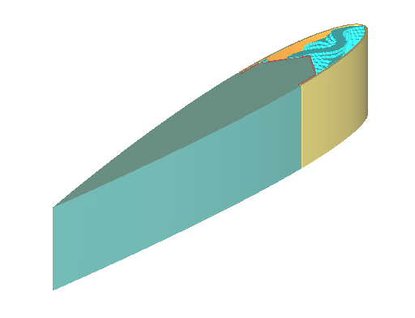
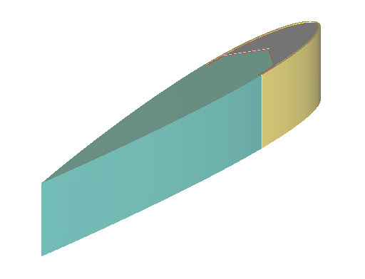
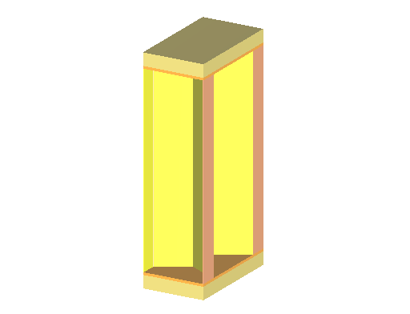

# AI Stealth Lab · 跨尺度电磁科研实验室

**From Microstructure to Aircraft RCS**

[](https://zhichengfeng.github.io/ZhichengFeng-Stealth-lab/)
[](#roadmap)
[](#技术栈)
[](#数据与产品边界)



**在线演示**：[主实验室](https://zhichengfeng.github.io/ZhichengFeng-Stealth-lab/) ｜ [无人值守演示 `/demo/`](https://zhichengfeng.github.io/ZhichengFeng-Stealth-lab/demo/) ｜ [AeroRepair Scan](https://zhichengfeng.github.io/ZhichengFeng-Stealth-lab/aerorepair-scan/)

> **English.** *AI Stealth Lab* is a runnable, interactive cross-scale electromagnetics showcase that links TPMS microstructures, unit-cell fields, port responses, S-parameters, retrieved effective material tensors, component layouts, surface currents and far-field RCS in one continuous visual chain. It ships with a ~30 s auto-play demo, six deterministic synthetic TPMS→RCS cases (Gyroid / Diamond / Primitive × TE / TM), a verified CST honeycomb reflection reference (8–12 GHz), the **AbsorbEvo** inverse-design workbench, and the **AeroRepair Scan** in-situ repair-assessment module. The project is under active development; a paper is in preparation.

## 目录

- [项目功能](#项目功能)
- [界面与参考几何](#界面与参考几何)
- [跨尺度链路](#跨尺度链路)
- [AeroRepair Scan 原位评估](#aerorepair-scan-原位评估)
- [AbsorbEvo 逆向设计](#absorbevo-逆向设计)
- [技术栈](#技术栈)
- [当前界面](#当前界面)
- [数据与产品边界](#数据与产品边界)
- [本地预览](#本地预览)
- [部署](#部署)
- [Roadmap](#roadmap)

## 项目功能

- 提供约 30 秒的自动“一镜到底”演示，也支持自由探索；
- 支持 Gyroid、Diamond、Primitive 三种 TPMS 结构，以及 TE / TM 极化切换；
- 可调节频率、入射角、观察尺度等参数，并联动更新三维场景与科研图表；
- 通过八个连续阶段展示从微观胞元到远场 RCS 的跨尺度信息传递；
- 可视化胞元场、端口切向场、S 参数、等效介电常数张量、机翼前缘、表面电流热点和 RCS；
- 提供 CST 独立参考数据入口，并在界面中明确区分真实数据、合成演示数据和预留求解接口；
- 集成 **AbsorbEvo** 逆向设计工作台，用证据受控的方式诊断现有吸波结构，并提出下一步值得验证的改进方向；
- 集成 **AeroRepair Scan** 原位评估模块，把设计端的整机 RCS 链路延伸到修复后的近场扫描、缺陷定位与质量评估。

## 界面与参考几何

| Gyroid | Diamond | Primitive |
| :---: | :---: | :---: |
|  |  |  |

| 前缘 TPMS 铺设细节 | 前缘均质化视图 | CST 吸波蜂窝参考 |
| :---: | :---: | :---: |
|  |  |  |

> 动态演示见 [无人值守演示页面](https://zhichengfeng.github.io/ZhichengFeng-Stealth-lab/demo/)（约 30 秒一镜到底，可直接用于录屏）。

## 跨尺度链路

```text
TPMS 微观胞元
→ 胞元场
→ 两端口切向场
→ S 参数
→ 等效介电常数张量
→ 机翼前缘
→ 表面电流热点
→ 远场 RCS
→ 修复区域近场扫描
→ 修复质量评估
```

## AeroRepair Scan 原位评估

[AeroRepair Scan](./aerorepair-scan/) 是 Stealth Lab 的 **Module 09**，面向隐身飞机复合材料／吸波结构修复后的便携式原位检测。它将“双极化微波探头 + 便携式矢量网络分析仪 + 位姿与距离感知 + 边缘计算 + 数字孪生”组织为一条可理解、可交互的扫描流程。

模块包含高清核心设备图、飞机机翼扫描场景、六种概念验证案例，以及频率、极化、探头距离、热图、指标和自动扫描动画。公开页面采用原生 HTML/CSS/JavaScript 静态实现，可随 GitHub Pages 直接部署；完整 Python/Gradio 版本继续作为独立验证端，避免把运行时后端、登录状态或跨域依赖带入公开站点。

```text
结构／材料设计 → 整机 RCS → 现场修复 → 近场扫描 → 缺陷定位 → 质量评估
```

## AbsorbEvo 逆向设计

AbsorbEvo 让 Stealth Lab 从“展示计算结果”进一步走向“思考下一步改什么”。工作台围绕以下闭环组织设计推理：

```text
任务与约束 → 物理诊断 → Prior 候选搜索 → CST Exact 验证 → Evaluator 更新
```

它目前可展示针对阻抗失配、损耗不足、厚度—带宽冲突以及角度／极化敏感等问题的诊断逻辑，并给出受材料无源性、厚度、质量和制造条件约束的候选改进方向。所有候选都必须经过确定性验证后才能更新当前设计。

## 技术栈

- vinext / Next.js App Router
- React 19 + TypeScript
- Three.js / React Three Fiber / drei
- GSAP
- Zustand
- ECharts
- Python 数据生成、转换与校验工具
- Vitest 与 Playwright Core

## 当前界面

- 自动演示与自由探索两种使用模式；
- 连续三维场景、阶段时间轴、参数控制面板和科研图表联动；
- TPMS、端口场、S 参数、等效张量、前缘铺设、整机电流与 RCS 多尺度视图；
- CST 参考几何与吸波蜂窝反射曲线查看；
- AbsorbEvo 的设计闭环、典型瓶颈诊断、证据状态和后续验证门槛；
- AeroRepair Scan 的核心设备、原位扫描工作流与交互式概念评估；
- `/demo/` 无人值守演示页面，可用于录制与展示。
- `/aerorepair-scan/` 修复后原位扫描与质量评估页面。

## 数据与产品边界

| 对象 | 性质 | 说明 |
| --- | --- | --- |
| 六个完整的 TPMS → RCS 案例 | 合成演示数据 | 确定性合成，用于展示交互、数据结构和跨尺度工作流，不能据此声称获得了真实整机 RCS |
| CST 吸波蜂窝共极化反射缓存 | 真实仿真参考 | 覆盖 8–12 GHz、共 1,001 个频点，包含 TE / TM 反射；不包含 S21，也不构成完整的 TPMS → RCS 链路 |
| 网页中的 TPMS、前缘与整机对象 | 轻量化程序表示 | 依据参考几何构建，并非与 CST 网格逐顶点一致 |
| AbsorbEvo | 证据受控的设计推理 | 提供可验证假设，不替代 CST 求解，也不会把未经验证的候选描述为整机 RCS 提升 |
| AeroRepair Scan | 概念验证级合成数据 | 用于说明近场扫描流程、交互与数据结构，不替代经校准仪器测量、无损检测判读或适航认证 |

## 本地预览

本仓库保存的是 GitHub Pages 静态发布版本。请保留默认目录名 `ZhichengFeng-Stealth-lab`，在它的上一级目录运行：

```powershell
python -m http.server 3000
```

然后访问：

```text
http://127.0.0.1:3000/ZhichengFeng-Stealth-lab/
http://127.0.0.1:3000/ZhichengFeng-Stealth-lab/aerorepair-scan/
```

## 部署

本仓库用于发布 AI Stealth Lab 的 GitHub Pages 静态版本。更新合并到 `main` 分支并完成 GitHub Pages 部署后，公开页面会同步显示最新内容。

## Roadmap

- [x] 跨尺度可视化链路（TPMS 微观胞元 → 远场 RCS，八阶段一镜到底）
- [x] 六个确定性合成演示案例（3 种 TPMS 结构 × TE / TM 极化）
- [x] CST 真实参考数据接入（吸波蜂窝共极化反射，8–12 GHz，1,001 频点）
- [x] AbsorbEvo 逆向设计工作台框架
- [x] AeroRepair Scan 修复后原位评估模块（Module 09）
- [ ] 完整 TPMS → RCS 链路的真实仿真验证案例
- [ ] 更多 CST 求解结果与实测数据接入
- [ ] 论文撰写与发表（in preparation）
