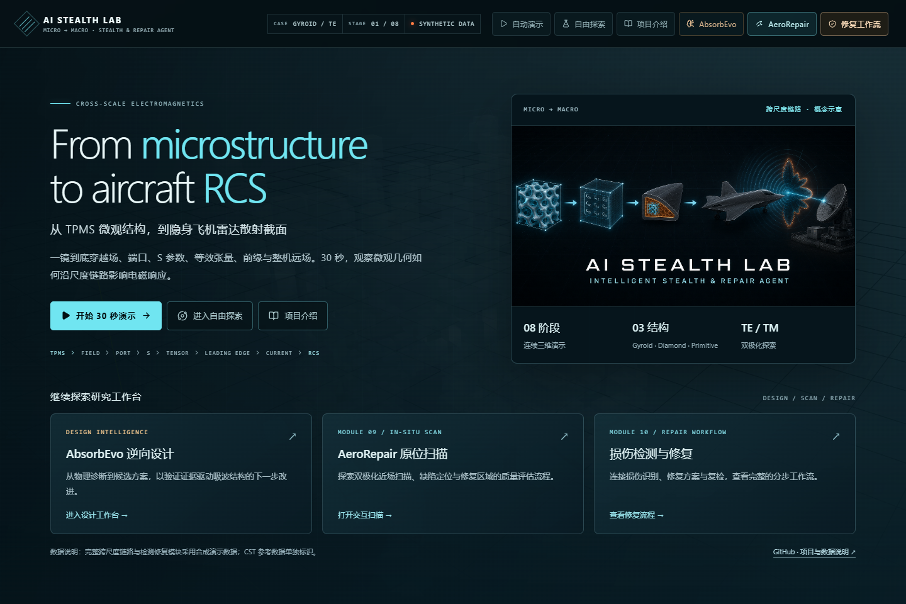

# AI Stealth Lab

### 从微观结构，到隐身与修复的跨尺度科研展示

**From Microstructure to Aircraft RCS**

[](https://zhichengfeng.github.io/ZhichengFeng-Stealth-lab/)
[](#本地预览)
[](#数据来源与边界)



把 TPMS 微观胞元、局部电磁场、端口响应、等效材料、飞机散射和修复评估连接起来。用约 30 秒连续三维演示理解尺度之间的关系，再进入参数探索、逆向设计和检测修复工作流。

> **English.** An interactive cross-scale electromagnetics showcase, connecting TPMS microstructures to aircraft scattering and repair assessment. Explore eight linked stages, six deterministic synthetic cases, an independent CST honeycomb reflection reference, the AbsorbEvo design workbench, and two repair modules. This repository contains the published static website; full-chain results are demonstration data.

## 开始探索

| 入口 | 可以体验什么 |
| --- | --- |
| **[主实验室](https://zhichengfeng.github.io/ZhichengFeng-Stealth-lab/)** | 30 秒跨尺度演示、自由探索、项目介绍，以及 AbsorbEvo 工作台 |
| **[演示专页](https://zhichengfeng.github.io/ZhichengFeng-Stealth-lab/demo/)** | 独立演示与录屏入口 |
| **[AeroRepair Scan · Module 09](https://zhichengfeng.github.io/ZhichengFeng-Stealth-lab/aerorepair-scan/)** | 修复区域的概念近场扫描、缺陷定位与质量评估 |
| **[Repair Workflow · Module 10](https://zhichengfeng.github.io/ZhichengFeng-Stealth-lab/repair-workflow/)** | 蜂窝夹层结构的损伤认知、超声/电磁检测与挖补修复 |

建议先在主实验室点击「开始 30 秒演示」，再用「自由探索」查看 Gyroid / Diamond / Primitive、TE / TM 极化及各阶段图表。AbsorbEvo 从主实验室的同名按钮进入。

## 一条连续的科研链路

```text
01 TPMS 胞元 → 02 局部场 → 03 端口场 / S 参数 → 04 等效张量
                                                   ↓
08 远场 RCS ← 07 表面电流 ← 06 整机照射 ← 05 前缘结构
     ↓
损伤检测 → 挖补修复 → 修复后近场扫描与评估
```

主实验室把三维场景、阶段时间轴、参数面板和科研图表联动起来。可以切换结构、极化、频率、入射角与观察尺度，查看端口切向场、反射/透射、等效介电常数张量、前缘铺设、表面热点和远场 RCS。

### 参考几何

| Gyroid | Diamond | Primitive |
| :---: | :---: | :---: |
|  |  |  |

| 前缘 TPMS 铺设 | 前缘均质化 | 吸波蜂窝 |
| :---: | :---: | :---: |
|  |  |  |

以上为参考几何图片；首页截图中的跨尺度配图为概念示意。网页三维对象采用轻量化表示。

## 设计与修复模块

### AbsorbEvo · 逆向设计

围绕「任务与约束 → 物理诊断 → Prior 候选搜索 → CST Exact 验证 → Evaluator 更新」组织设计推理，展示阻抗失配、损耗不足、厚度与带宽、角度与极化敏感等瓶颈，以及材料无源性、质量和制造约束。当前工作台提供诊断框架和待验证方向；公开页面不运行 CST 求解。

### AeroRepair Scan · 原位评估

将双极化微波探头、便携式矢量网络分析仪、位姿与距离感知、边缘计算和数字孪生串成可交互的扫描流程。提供设备概念图、机翼扫描场景、六种合成案例、频率/极化/距离控制、热图和自动扫描动画。

实现为原生 HTML / CSS / JavaScript 静态页面。详见[模块说明](aerorepair-scan/README.md)。

### Repair Workflow · 损伤检测与修复

| 阶段 | 交互内容 |
| --- | --- |
| **Damage** | 可旋转的蜂窝夹层剖切模型；完好、冲击、穿孔和修复后四种状态 |
| **Sense** | 超声 A-scan、Hilbert 包络、六测点扫描及概念判定 |
| **Probe** | 波导探头扫描、S11 对照曲线、近场响应热图及近远场转换概念流程 |
| **Repair** | 标记、打磨、换芯、铺贴、固化、后检六步挖补修复动画 |

Three.js 已随模块保存，演示数据可确定性生成。详见[模块说明](repair-workflow/README.md)。

## 数据来源与边界

| 内容 | 数据性质 | 当前范围 |
| --- | --- | --- |
| 六个 TPMS → RCS 完整案例 | **合成演示** | 三种 TPMS × TE / TM，用于交互与跨尺度流程展示 |
| CST 吸波蜂窝反射缓存 | **独立真实仿真参考** | 8–12 GHz、1,001 频点、TE / TM 共极化反射；没有 S21 |
| TPMS、前缘与整机三维对象 | **轻量化几何表示** | 用于连续镜头和交互，不与 CST 网格逐顶点一致 |
| AbsorbEvo | **设计推理与接口框架** | 候选需要确定性验证，页面不直接给出已验证优化结果 |
| AeroRepair Scan / Repair Workflow | **概念验证与合成数据** | 展示扫描、检测和修复工作流，不代表实测缺陷判定或工程验收结果 |

完整链路目前不能用于声称真实整机 RCS、预测精度或隐身性能提升。独立 CST 参考也不构成完整 TPMS → RCS 验证。可查看[数据清单](data/manifest.json)、[数据校验记录](data/validation_report.json)和[CST 来源记录](data/real/cst_honeycomb_smoke.provenance.json)。

## 本地预览

**本仓库是 GitHub Pages 静态发布产物**，包含已构建的主应用和可直接维护的原生模块，不包含 React / TypeScript 源码工程或 npm 构建配置。预览只需要 Python 3 与支持 WebGL 的浏览器。

在保存项目的父目录中运行：

```powershell
git clone https://github.com/ZhichengFeng/ZhichengFeng-Stealth-lab.git
python -m http.server 3000 --bind 127.0.0.1
```

打开以下地址：

- [主实验室](http://127.0.0.1:3000/ZhichengFeng-Stealth-lab/)
- [演示专页](http://127.0.0.1:3000/ZhichengFeng-Stealth-lab/demo/)
- [AeroRepair Scan](http://127.0.0.1:3000/ZhichengFeng-Stealth-lab/aerorepair-scan/)
- [Repair Workflow](http://127.0.0.1:3000/ZhichengFeng-Stealth-lab/repair-workflow/)

保留目录名 `ZhichengFeng-Stealth-lab` 并从父目录启动服务器：主应用资源路径包含这一前缀。请通过 HTTP 访问，直接双击 HTML 无法可靠加载模块和数据。

## 项目结构与维护

```text
index.html / demo/       主实验室与演示入口
assets/                 已构建的主应用、独立视觉增强层与模块入口脚本
data/                   合成案例、manifest 和 CST 独立参考
models/ / reference/    轻量模型、来源信息与参考几何图
aerorepair-scan/         Module 09：原生静态扫描模块
repair-workflow/         Module 10：原生静态检测修复模块
docs/                   发布维护说明
tools/                  静态资源与数据完整性检查
```

主应用来自 vinext / Next.js App Router、React 19、TypeScript、Three.js / React Three Fiber、GSAP、Zustand 和 ECharts 的构建产物；数据生产端使用 Python。两项修复模块使用原生浏览器技术，不依赖运行中的 Python 后端。

在仓库根目录运行发布前静态检查：

```powershell
python tools/check_site.py
```

该检查验证本地页面链接、静态资源和 manifest 中的资源哈希；三维交互、移动端布局与图表仍需浏览器验收。完整维护方法见[静态网站维护说明](docs/maintaining-static-site.md)。

GitHub Pages 发布目录为本仓库根目录。更新推送到 `main` 后，以仓库 Pages 部署任务成功以及线上页面验收为发布完成依据。

## 后续工作

- [x] 八阶段连续演示与六组合成案例
- [x] CST 吸波蜂窝独立反射参考
- [x] AbsorbEvo 设计推理工作台框架
- [x] AeroRepair Scan 原位扫描模块
- [x] Repair Workflow 损伤检测与修复模块
- [ ] 完整 TPMS → RCS 真实仿真验证案例
- [ ] 更多经校验的 CST 结果与实测数据
- [ ] 论文撰写与发表

作者：**Zhicheng Feng**。使用条款见 [LICENSE](LICENSE)。
